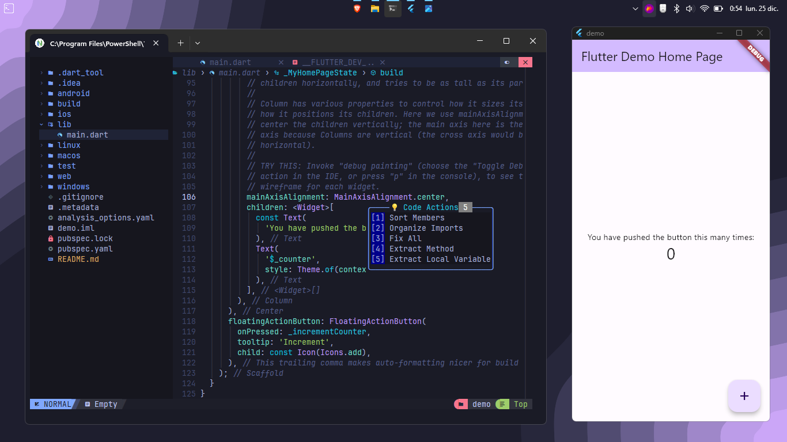

# nvchad para Flutter
Este repositorio contiene la configuración de nvchad para facilitar el desarrollo en Flutter (Mi configuracion personal). nvchad es una potente configuración de Neovim que proporciona una experiencia de programación eficiente y personalizable.

## Captura de Pantalla

## Contenido adicional a la configuracion por defecto de Nvchad
👌 Configuracion para Flutter
👍 Autoguardado
🍿 Autocompletado con tabnine
🤖 (optional) Github Copilot "require descomentar un par de lineas de codigo"
🖥️ Tema tokyonight
😶‍🌫️ LunarVim color Schemes
🫡 LspSaga 
🤐 Pretty Folding 
🙂 Varios atajos inspirado en LunarVim

Entre otros... 🥲🥲
u otros por venir.

## Agradecimientos para 
https://nvchad.com/
